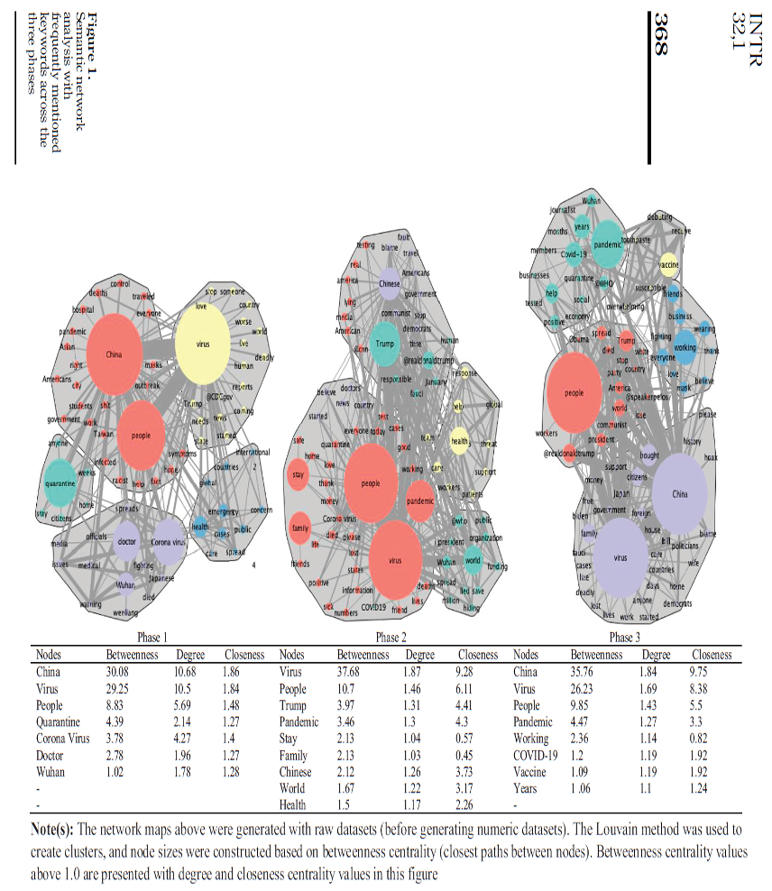

### Assignments

#### UTD EPPS 6356 Data Visualization

#### Assignment 1

#### 1) Google "generative art". Cite some examples.

As the link, you can check out 'Generative Art: 50 Best Examples, Tool & Artists'

#### 2) Run Fall.R


::: {.cell}

```{.r .cell-code}
# Title Fall color
# Credit: https://fronkonstin.com

# Install packages
# install.packages("gsubfn")
library(gsubfn)
```

::: {.cell-output .cell-output-stderr}
```
Loading required package: proto
```
:::

::: {.cell-output .cell-output-stderr}
```
Warning in doTryCatch(return(expr), name, parentenv, handler): unable to load shared object '/Library/Frameworks/R.framework/Resources/modules//R_X11.so':
  dlopen(/Library/Frameworks/R.framework/Resources/modules//R_X11.so, 0x0006): Library not loaded: '/opt/X11/lib/libSM.6.dylib'
  Referenced from: '/Library/Frameworks/R.framework/Versions/4.2/Resources/modules/R_X11.so'
  Reason: tried: '/opt/X11/lib/libSM.6.dylib' (no such file), '/Library/Frameworks/R.framework/Resources/lib/libSM.6.dylib' (no such file), '/Library/Java/JavaVirtualMachines/jdk1.8.0_241.jdk/Contents/Home/jre/lib/server/libSM.6.dylib' (no such file)
```
:::

::: {.cell-output .cell-output-stderr}
```
tcltk DLL is linked to '/opt/X11/lib/libX11.6.dylib'
```
:::

::: {.cell-output .cell-output-stderr}
```
Could not load tcltk.  Will use slower R code instead.
```
:::
:::

::: {.cell}

```{.r .cell-code}
# install.packages("tidyverse")
library(tidyverse)
```

::: {.cell-output .cell-output-stderr}
```
── Attaching packages ─────────────────────────────────────── tidyverse 1.3.2 ──
✔ ggplot2 3.3.6     ✔ purrr   0.3.4
✔ tibble  3.1.8     ✔ dplyr   1.0.9
✔ tidyr   1.2.0     ✔ stringr 1.4.1
✔ readr   2.1.2     ✔ forcats 0.5.2
── Conflicts ────────────────────────────────────────── tidyverse_conflicts() ──
✖ dplyr::filter() masks stats::filter()
✖ dplyr::lag()    masks stats::lag()
```
:::
:::

::: {.cell}

```{.r .cell-code}
# Define elements in plant art
# Each image corresponds to a different axiom, rules, angle and depth

# Leaf of Fall

axiom="X"
rules=list("X"="F-[[X]+X]+F[+FX]-X", "F"="FF")
angle=22.5
depth=6


for (i in 1:depth) axiom=gsubfn(".", rules, axiom)

actions=str_extract_all(axiom, "\\d*\\+|\\d*\\-|F|L|R|\\[|\\]|\\|") %>% unlist

status=data.frame(x=numeric(0), y=numeric(0), alfa=numeric(0))
points=data.frame(x1 = 0, y1 = 0, x2 = NA, y2 = NA, alfa=90, depth=1)


# Generating data
# Note: may take a minute or two

for (action in actions)
{
  if (action=="F")
  {
    x=points[1, "x1"]+cos(points[1, "alfa"]*(pi/180))
    y=points[1, "y1"]+sin(points[1, "alfa"]*(pi/180))
    points[1,"x2"]=x
    points[1,"y2"]=y
    data.frame(x1 = x, y1 = y, x2 = NA, y2 = NA,
               alfa=points[1, "alfa"],
               depth=points[1,"depth"]) %>% rbind(points)->points
  }
  if (action %in% c("+", "-")){
    alfa=points[1, "alfa"]
    points[1, "alfa"]=eval(parse(text=paste0("alfa",action, angle)))
  }
  if(action=="["){
    data.frame(x=points[1, "x1"], y=points[1, "y1"], alfa=points[1, "alfa"]) %>%
      rbind(status) -> status
    points[1, "depth"]=points[1, "depth"]+1
  }
  
  if(action=="]"){
    depth=points[1, "depth"]
    points[-1,]->points
    data.frame(x1=status[1, "x"], y1=status[1, "y"], x2=NA, y2=NA,
               alfa=status[1, "alfa"],
               depth=depth-1) %>%
      rbind(points) -> points
    status[-1,]->status
  }
}

ggplot() +
  geom_segment(aes(x = x1, y = y1, xend = x2, yend = y2),
               lineend = "round",
               color="blue", # Set your own Fall color?
               data=na.omit(points)) +
  coord_fixed(ratio = 1) +
  theme_void() # No grid nor axes
```

::: {.cell-output-display}
{width=672}
:::
:::


#### 3) Write a critique on a graphic in published work (book/article/news website)

##### **"Exploring incivility and moral foundations toward Asians in English-speaking tweets in hate crime-reporting cities during the COVID-19 pandemic"**

##### **Bumsoo Kim, Eric Cook and Seong-Kyu Kim (2021)**

***Purpose***

The purpose of this study was to find out how many Twitter users were participating in immoral and ethically dubious comments on specific Asian countries and residents. The integrated threat theory (ITT) has been utilized to develop issues about rudeness and moral implications in COVID-19-related Twitter dialogue (Kim et al, 2021).

***Research Design***

The authors brought the English-speaking United States (US) through three stages: (1) early diagnosis of COVID-19 in China, (2) high COVID-19 death rates in the United States, and (3) news that a vaccine will be available in the U.S shortly. They gathered tweets and retweets from Twitter users (Kim et al, 2021).

***Findings***

The authors discovered substantial disparities in disrespectful tweets written in cities with higher hate crimes against Asians than in low-level areas. Finally, while describing China and its culture and population, English-speaking Twitter users preferred to employ moral virtues and moral evils (Kim et al, 2021).

***Critique of figures***

The limitations of this study are as follows: First, it's a figure 1 that shows a step-by-step change, but it's not clear which city it's targeting or specific information about it because we used Twitter data. In addition, the authors did not collect information from all cities in the United States. In addition, it seems necessary to cover more sample cities with more diverse search keywords, including future researchers, to investigate the link between disrespect and actual aggressive behavior on social media (Kim et al, 2021). Also, in order to identify the interaction between tweets, it is thought that other variables may be included to generate more interesting visualizations. This, in turn, indicates the need for further research to supplement the data. In other words, there is a limit to generalization.



**References**

Kim, B., Cooks, E., & Kim, S.K. (2021, August 26). Exploring incivility and moral foundations toward Asians in English-speaking tweets in hate crime-reporting cities during the COVID-19 pandemic. *Internet Research*, *32*(1), 362--378.

